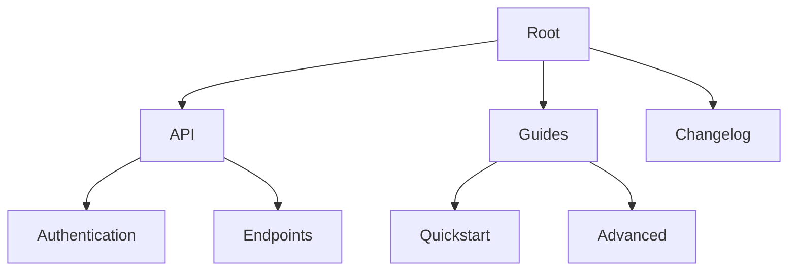

## Overview

SIVAKUMAR S provides powerful features to manage your project documentation efficiently. You organize content into intuitive structures, collaborate seamlessly with teams, track changes over time, and find information quickly. These core capabilities help you maintain up-to-date, accessible docs without complexity.

<Callout kind="tip">
Start by setting up your folder structure to unlock the full potential of these features.
</Callout>

## Key Features Overview

<Columns cols={2}>
  <Card title="Document Organization" icon="folder" href="#document-organization">
    Create nested folders and pages to keep your docs structured and easy to navigate.
  </Card>
  <Card title="Collaboration Tools" icon="users" href="#collaboration">
    Enable real-time editing and comments for team-based workflows.
  </Card>
  <Card title="Version History" icon="git-branch" href="#version-history">
    Track every change with rollback capabilities.
  </Card>
  <Card title="Advanced Search" icon="search" href="#advanced-search">
    Filter and discover content across your entire documentation space.
  </Card>
</Columns>

## Document Organization and Folder Structures

Organize your documentation using hierarchical folders and pages. You create custom structures that mirror your project's architecture, making navigation intuitive.



<Steps>
  <Step title="Create a Folder" icon="folder-plus">
    Navigate to your workspace root. Click the `+` button and select `New Folder`. Name it descriptively, like `API Reference`.
  </Step>
  <Step title="Add Pages" icon="file-plus">
    Inside the folder, create new pages. Use the page editor to add markdown content or import existing files.
  </Step>
  <Step title="Nest Structures" icon="chevron-down">
    Drag and drop pages into subfolders for deeper organization.
  </Step>
</Steps>

## Collaboration and Real-Time Editing Tools

Invite team members to collaborate in real-time. Multiple users edit simultaneously, with live cursors and conflict resolution.

<Tabs>
  <Tab title="Invite Collaborators" icon="user-plus">
    Go to workspace settings. Add emails or share public links. Set permissions: `view`, `edit`, or `admin`.
  </Tab>
  <Tab title="Real-Time Editing" icon="edit-3">
    Open a page. See live changes from others with colored cursors. Use `@mentions` for comments.
  </Tab>
</Tabs>

<Callout kind="info">
Resolve conflicts by accepting changes or reverting to previous versions during sessions.
</Callout>

## Version History and Change Tracking

Every edit creates a snapshot. You review, compare, and restore versions easily.

<CodeGroup tabs="API,CLI">
  ```javascript
  // Fetch version history via API
  const response = await fetch('https://api.example.com/docs/{pageId}/history', {
    headers: { Authorization: `Bearer ${YOUR_TOKEN}` }
  });
  const history = await response.json();
  console.log(history.versions); // Array of snapshots
  ```
  ```bash
  # CLI command to list versions
  sivakumar-s docs history --page "api-reference" --limit 10
  ```
</CodeGroup>

<Steps>
  <Step title="View History" icon="clock">
    Open a page. Click `History` in the menu to see a timeline of changes.
  </Step>
  <Step title="Compare Versions" icon="git-compare">
    Select two versions. Review diffs side-by-side.
  </Step>
  <Step title="Restore" icon="refresh-cw">
    Click `Restore this version` to revert.
  </Step>
</Steps>

## Advanced Search and Content Filtering

Search across all docs with filters for tags, authors, and dates. Results update in real-time as you refine queries.

<ParamField path="query" param-type="string" required="true">
  Your search term, supports boolean operators like `AND` or `OR`.
</ParamField>

<ParamField query="tags" param-type="array" required="false">
  Filter by document tags, e.g., `api`, `guide`.
</ParamField>

<ParamField query="dateFrom" param-type="date" required="false">
  Start date for results (ISO format: `2024-01-01`).
</ParamField>

Example API usage:

```javascript highlight="2-4"
const search = await fetch('https://api.example.com/search', {
  method: 'POST',
  body: JSON.stringify({
    query: 'authentication',
    tags: ['api', 'security']
  })
});
```

## Next Steps

Explore these features hands-on:

<Columns cols={3}>
  <Card title="Quickstart" icon="zap" href="/quickstart">
    Set up your first workspace.
  </Card>
  <Card title="Authentication" icon="shield" href="/authentication">
    Secure your docs.
  </Card>
  <Card title="API Reference" icon="code" href="/introduction#api">
    Integrate programmatically.
  </Card>
</Columns>

<Expandable title="Advanced Tips" default-open="false">
  Combine search filters with version history queries for auditing changes. Use webhooks for custom notifications on edits.
</Expandable>